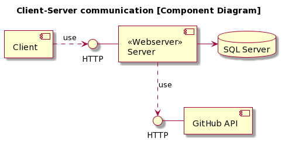
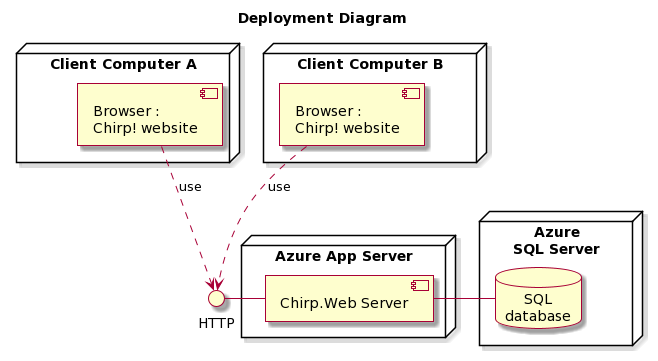

# Design and Architecture of _Chirp!_

## Domain model


The Author class represents a user in _Chirp!_.
The Cheep class represents the messages shared on the _Chirp!_ platform.
A Cheep is written by an Author, and an Author can write many Cheeps.
An Author can follow, as well as be followed by, many other Authors.
An Author can like a Cheep. A Cheep can be liked by many Authors.

## Architecture — In the small

The architecture is illustrated on figure \ref{onion_arch_diagram} with three circles representing the layers of our onion architecture. The legend to the left should be self-explanatory except for the terms Grouping of classes. Grouping of classes refers to a set of classes that serve similar functions e.g. the Repositories - it is an abstraction made to increase readability.


## Architecture of deployed application

<!-- UML component diagram shows components, provided and required interfaces, ports, and relationships between them. -->

The following component diagram shows how the different high level components communicate with each other.



The client communicates with the Azure web server using HTTP requests. The Azure web server itself uses HTTP requests to get information about the user from the GitHub API. Furthermore, the Azure web server has a connection to the Azure SQL Server which contains the database.

The following deployment diagram shows the artifacts of the system and where they are deployed.



Each client computer uses a browser, which uses HTTP requests, to access the website. The Chirp.Web project executable is deployed on an Azure App Server which hosts it, and has a connection to an Azure SQL Server. The SQL Server contains a database with all the persistent data of the _Chirp!_ application.

## User activities

The following user activity diagrams are for typical user journeys in our _Chirp!_ application, where a user completes a couple of tasks.

The figure below illustrates a user journey for an **unauthenticated** user of the application.


"Author X" represents any author present on the second page of the public timeline.

The diagram below illustrates a user journey for an **authenticated** user of the application.


The next diagram illustrates a user journey where a user wants to exercise their GDPR rights.


## Sequence of functionality/calls through _Chirp!_


The figure \ref{functionsequence} illustrates the sequence of events, from a user requests the root of _Chirp!_ to a page is rendered and returned.

# Process

## Build, test, release, and deployment

The following UML activity diagrams illustrate the GitHub actions workflows that are run when different criteria are met. This will be briefly described under the respective diagrams. Note that each step can fail and will result in the Github Action aborting.


The workflow on figure \ref{build_test_workflow} is run upon every push and pull request to main. It builds and tests the application in order to keep main void of faulty code (as a **safety net**).


The deployment workflow illustrated on figure \ref{deployment_workflow} is run upon every push to main. Note the redundant "build" step. We do not need this since the "publish" step already builds the application. This redundancy was not noticed during development and has not been removed due to time constraints. The illustration describes the two jobs: "build" and "deploy". Jobs are normally run in parallel, however, these are run sequentially as we do not want to deploy before the application is successfully built.


The release workflow illustrated on figure \ref{release_workflow} only runs if a push to main contains a version tag. We've made use of a matrix strategy in order to automatically create multiple parallel job runs that build, publish, zip and release the application for their respective platform.

## Team work

No functionality is in progress, but a bug has been spotted. Planned features we did not get to implement include:

- A character counter when writing cheeps
- Adding liked cheeps to about me page (as well as the "Download my data" json data)

To get an overview of our group work consult figure \ref{groupwork}.

After an issue has been created we assign responsibility for it to one or more persons.

We work alone or with pair programming iteratively in research and implement steps until the issue is handled.

Then we create a pull request and notify group members who are not involved. They strive to review within 24 hours. If the request is approved we merge it into the Main branch. Otherwise we evaluate whether or not to continue working on the issue or close it with a comment.

Ideally after merging a tag is applied and pushed which triggers the release workflow.


## How to make _Chirp!_ work locally

### Prerequisites

- .NET (>=7.0)
- dotnet ef-tools
- Docker
- Azure AD B2C Tenant
- Github OAuth App

### Azure AD B2C

_Chirp!_ uses an Azure AD B2C user flow for authentication. The `AzureADB2C` object in `appsettings.Development.json` must be configured according to [Step 2. of the documentation](https://learn.microsoft.com/en-us/aspnet/core/security/authentication/azure-ad-b2c?view=aspnetcore-8.0).

1. Add a user-secret from within the `src/Chirp.Web` folder, using the following command in your terminal:

```bash
dotnet user-secrets set "AzureADB2C:ClientSecret" "[CLIENT-SECRET]"
```

| Replacing [CLIENT-SECRET] with your client secret from Azure.

2. You must configure your [Github OAuth App with your user flow on your Azure ADB2C tenant](https://learn.microsoft.com/en-us/azure/active-directory-b2c/identity-provider-github?pivots=b2c-user-flow).

### Local database

_Chirp!_ uses an MSSQL database, which can be run locally using Docker.

1. Set up the database using the following command from your terminal:

```bash
docker run -e "ACCEPT_EULA=Y" -e "MSSQL_SA_PASSWORD=my}}Pass;word" \
   -p 1433:1433 --name azuresql --hostname azuresql \
   -d \
   mcr.microsoft.com/mssql/server:2022-latest
```

| Password specifications can be found [here](https://learn.microsoft.com/en-us/sql/relational-databases/security/strong-passwords?view=sql-server-ver16). The given password is not of importance and is only used for the individual Docker instance.

2. Add a user-secret from within the `src/Chirp.Web` folder, using the following command in your terminal:

```bash
dotnet user-secrets set "ConnectionStrings:AZURE_SQL_CONNECTIONSTRING" "Server=localhost,1433;Initial Catalog=bdsagroup5-chirpdb;Persist Security Info=False;User ID=sa;Password=my}}Pass;word;MultipleActiveResultSets=False;Encrypt=True;TrustServerCertificate=True;Connection Timeout=30;"
```

3. The database is configured using the dotnet-ef tool by running the following command from within the `src/Chirp.Infrastructure` folder:

```bash
dotnet ef database update --startup-project "../Chirp.Web"
```

### Running _Chirp!_

To run _Chirp!_, use the following command from within the `src/Chirp.Web` folder, in your terminal:

```bash
dotnet run
```

## How to run test suite locally

### Running all tests

You need to have made _Chirp!_ work locally, before proceeding to running the tests. Before the end-2-end (E2E) tests can be run, Playwright needs to be installed. Here is a guide to install Playwright:

1. In the terminal, run the command: `dotnet tool install --global Microsoft.Playwright.CLI`
2. Navigate to the directory: `/test/Chirp.Web.End2EndTests`
3. Run the command: `playwright install`

Once you have installed Playwright, the tests are now ready to run. Here follows a guide to running our test suite locally (Make sure you have the local _Chirp!_ up and running):

1. In the terminal, navigate to the root directory (/Chirp) of the project
2. Run the command: `dotnet test`
3. A browser window will open, and at some point you will be requested to login to GitHub.

### Running only unit & integration tests

If you do not want to run the E2E tests, they can be filtered out, allowing you to only run the unit and integration tests, with the following command:

`dotnet test --filter "TestCategory!=End2End"`

This command will produce the following warning:
_No test matches the given testcase filter 'TestCategory!=End2End'_

This is because we use both NUnit and xUnit for our tests. We use NUnit for the E2E tests and xUnit for the rest. NUnit correctly ignores the E2E test, but xUnit will not recognize these tests as they are not part of the xUnit test suite, resulting in the warning being produced.

### About our test suite

The test suite contains three different test projects:

1. Chirp.Infrastructure.Tests
2. Chirp.Web.End2EndTests
3. Chirp.Web.Tests

The Chirp.Infrastructure.Tests and Chirp.Web.Tests project contains unit-tests and integration tests for the Chirp.Infrastructure and Chirp.Web projects respectively.

The Chirp.Web.End2EndTests project tests the whole program, including UI and key functionality throughout _Chirp!_. This test project uses the NUnit test framework. The other projects use the xUnit testing tool.

# Ethics

## License

Our _Chirp!_ application is licensed under [Creative Commons Attribution Share Alike 4.0 International](https://github.com/ITU-BDSA23-GROUP5/Chirp/blob/main/LICENSE).

| Permissions    | Limitations   | Conditions                   |
| -------------- | ------------- | ---------------------------- |
| Commercial use | Liability     | License and copyright notice |
| Modification   | Trademark use | Changes are stated           |
| Distribution   | Patent use    | The license is kept          |
| Private use    | Warranty      |                              |

All dependencies in src use either the MIT License (e.g. Microsoft.EntityFrameworkCore.design, Microsoft.EntityFrameworkCore.SqlServer) or the Apache License 2.0 (e.g. FluentValidation), both of which are permissive and **allow for sublicensing**.

## LLMs, ChatGPT, CoPilot, and others

Two of our five members used LLMs throughout the development. One of whom stopped their use, as they felt their perspective on the code was impaired in terms of possible solutions. The other primarily used it for Azure ADB2C and ASP.NET configuration.

We have used the following LLMs in some manner during the project.

We have used GitHub Copilot in some of the development process of the project. Copilot has mainly been utilized for generation of small code snippets. For example, this was done for manually accessing login and logout URLs, before we knew we had to import "taghelpers" in cshtml files to use ASP.NET specific.

GitHub Copilot's chat functionality within the workspace and ChatGPT were rarely used during the project. This was mainly used for researching purposes to get details about a concept or receive an explanation of some code examples from the internet. ChatGPT and Copilot chat primarily helped to gain an understanding of a subject, before implementing a feature.

The usage of LLMs did not have a substantial effect on the development speed. In some situations, the LLMs improved our understanding of the given issue, and sped up the development. In other situations, the response was misleading or imprecise, leading to inefficiency.
